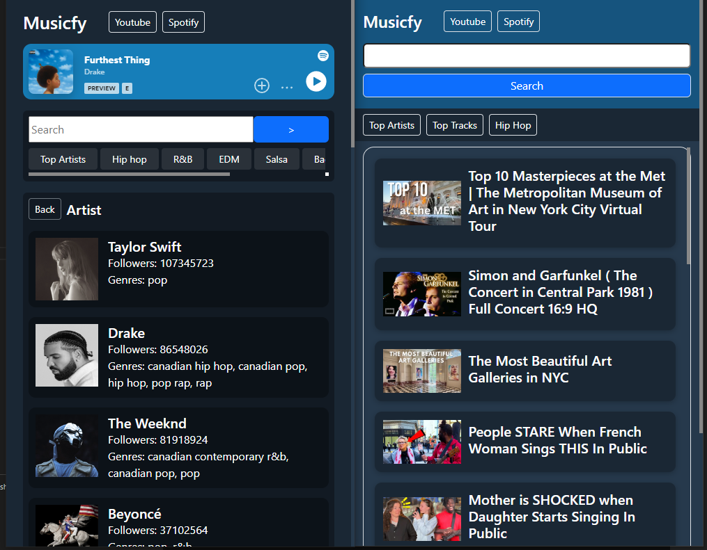

# Musicfy

Musicfy is a dynamic web application designed to bring your favorite music and videos from YouTube and Spotify to one place. Explore music and videos using an intuitive interface powered by the YouTube and Spotify APIs.

**Live Application**: [Visit Musicfy](https://febres0492.github.io/musicfy)

## Features

### YouTube API Page
- **YouTube Query Search**: Search for videos directly through YouTube's vast library.
- **Embedded Video Player**: Watch your favorite YouTube videos directly on Musicfy.

### Spotify API Page
- **Categories Search**: Browse through different Spotify categories to find music that fits any mood or activity.
- **Artist Search**: Look up your favorite artists and explore their music catalog.
- **New Releases Search**: Discover the latest music releases.
- **History Navigation**: Easily navigate through your search history.

### Additional Features
- **Serverless Authentication**
- **Repository**: https://github.com/febres0492/musicfy-api

## Technologies Used
- Bootstrap
- jQuery
- AJAX

## Collaborators
- Carlos Ferbes
- Mike Smith
- Faisal Salam
- Andrea Estevez
- Corey Crespo
